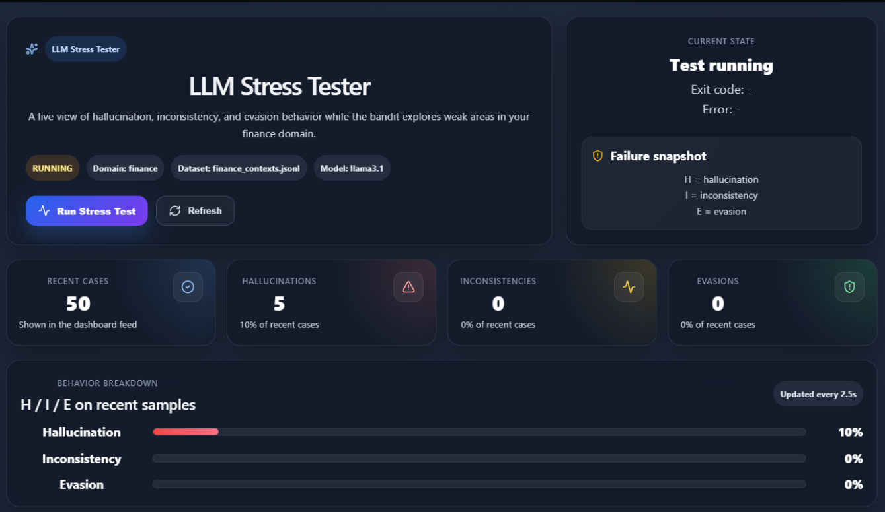
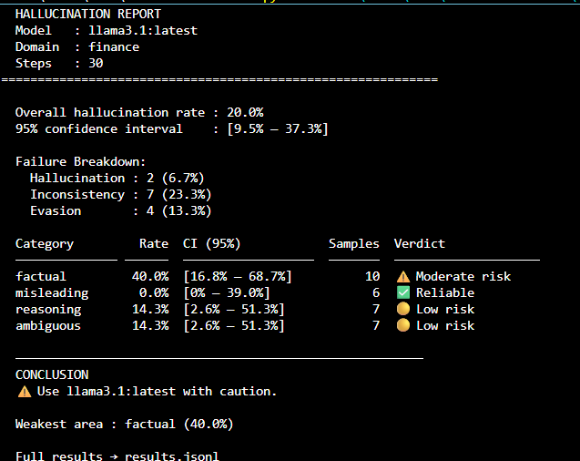

# 🚀 RAG-Based LLM Stress Testing Framework

## 📌 Overview

This project presents a **robust, adaptive stress-testing framework for Retrieval-Augmented Generation (RAG) systems and Large Language Models (LLMs)**. It is designed to systematically uncover weaknesses such as **hallucinations, evasive responses, and inconsistencies** using a combination of **adversarial prompt generation** and an **Upper Confidence Bound (UCB) multi-armed bandit algorithm**.

Unlike static evaluation pipelines, this system **dynamically learns which types of prompts expose the model’s weaknesses most effectively**, making it highly efficient and scalable for real-world evaluation scenarios.

---

## 🎯 Objectives

* Evaluate LLM robustness under adversarial conditions
* Detect critical failure modes:

  * ❌ Hallucinations
  * ⚠️ Inconsistencies
  * 🚫 Evasive responses
* Optimize test case selection using reinforcement learning principles
* Provide actionable insights into model reliability

---

## 🧠 Core Concepts

### 1. Retrieval-Augmented Generation (RAG)

RAG systems combine:

* **Retriever** → Fetches relevant context
* **Generator (LLM)** → Produces answers using retrieved data

While powerful, RAG systems are prone to:

* Fabricating facts (hallucination)
* Ignoring context
* Producing vague or evasive answers

---

### 2. Adversarial Prompt Generation

The system generates diverse categories of prompts designed to stress the model:

* Ambiguous queries
* Contradictory inputs
* Edge-case factual questions
* Context-conflicting prompts

---

### 3. UCB Multi-Armed Bandit Algorithm

Each prompt category is treated as an “arm.” The algorithm balances:

* Exploration (trying new prompt types)
* Exploitation (focusing on high-failure categories)

This enables faster and smarter discovery of weaknesses.

---

## 📊 Dashboard (Interactive UI)



### Features:
- Real-time evaluation
- Failure tracking (H / I / E)
- Adaptive testing behavior
- Clean visualization for analysis
  
> ⚠️ Note:
> In early iterations (e.g., 30–50 test cases), certain failure types like 
> **inconsistencies** and **evasions** may not appear frequently. 
> This is expected behavior due to the **adaptive UCB algorithm**, which initially 
> focuses on the most easily exploitable weakness (e.g., hallucinations) before 
> exploring other failure modes.

---

## 📈 Terminal Evaluation Report



**Insights:**  
The model shows a **20% hallucination rate**, with **inconsistencies (23.3%)** as the most frequent failure mode, indicating issues with logical coherence.  
The **factual category (40%)** is the weakest, highlighting challenges in knowledge-grounded responses.  

> These results are driven by the **adaptive UCB testing strategy**, which prioritizes failure-prone areas, making the evaluation focused and realistic rather than uniform.
---

## ⚙️ System Architecture

```
User / Script Input
        ↓
Prompt Generator (Adversarial Categories)
        ↓
UCB Bandit Selector
        ↓
LLM / RAG System
        ↓
Response Analyzer
        ↓
Failure Classification
        ↓
Metrics + Dashboard + Logs
```

---

## 📂 Project Structure

```
llm-stress-tester/
│
├── backend/                  # FastAPI backend for evaluation APIs
├── frontend/                 # React dashboard for visualization
├── rag_llm_stress/           # Core stress testing logic (modules)
│
├── analyzer.py               # Response evaluation (hallucination, etc.)
├── bandit.py                 # UCB multi-armed bandit implementation
├── config.py                 # Configuration settings
├── generator.py              # Adversarial prompt generation
├── generate_rag_contexts_windows.py
├── main.py                   # Entry point for running experiments
├── models.py                 # Data models / schemas
├── rag.py                    # RAG pipeline integration
│
├── results.jsonl             # Stored evaluation results
├── backend_run.log           # Execution logs
├── README.md
```

---

## ⚙️ Setup Instructions

### 1. Clone the Repository

```
git clone <your-repo-url>
cd llm-stress-tester
```

### 2. Create Virtual Environment

```
python -m venv venv
venv\\Scripts\\activate   # Windows
```

### 3. Install Dependencies

```
pip install -r requirements.txt
```

### 4. Run Backend

```
cd backend
uvicorn main:app --reload
```

### 5. Run Frontend

```
cd frontend
npm install
npm start
```

### 6. Run Stress Testing

```
python main.py
```

---

## 🔍 Evaluation Metrics

| Metric             | Description                      |
| ------------------ | -------------------------------- |
| Hallucination Rate | Fabricated or unsupported claims |
| Inconsistency Rate | Logical contradictions           |
| Evasion Rate       | Failure to answer directly       |
| Reward Signal      | Guides UCB optimization          |

---


## 📊 Output & Visualization

* Real-time dashboard insights (React UI)
* Terminal-based reports
* JSONL logs for analysis

---

## 💡 Key Innovation

This project introduces **adaptive evaluation**:

* Traditional testing → static datasets
* This system → self-optimizing evaluation

It continuously learns where the model fails and focuses testing there.

---

## 🧠 Use Cases

* RAG system evaluation
* AI safety testing
* Adversarial prompt research
* Enterprise LLM validation

---

## 🚧 Challenges Addressed

* Sparse failures in small datasets
* Exploration vs exploitation tradeoff
* Subtle inconsistency detection

---

## 🔮 Future Work

* Advanced semantic inconsistency detection
* Multi-model benchmarking
* Vector DB integration


## 🧾 Conclusion

This framework transforms LLM evaluation into an **intelligent, adaptive process**, making it significantly more effective than traditional methods for identifying real-world model weaknesses.
